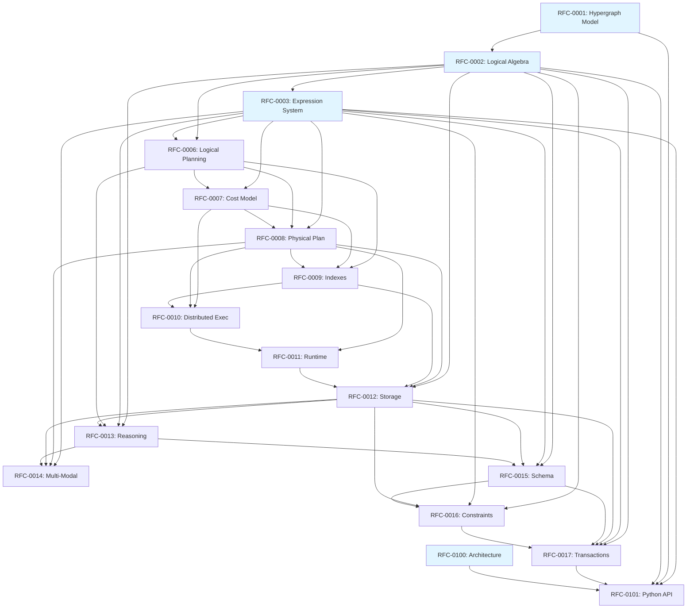

# RFC Index

This document provides a comprehensive index of all RFCs (Requests for Comments) in the Grism project. RFCs define the specifications, architecture, and design decisions that govern the system.

---

## RFC Status Legend

- **Frozen**: Immutable specification serving as production reference. Updates create versioned files (`rfc-NNNN-VVV.md`)
- **Draft**: Work in progress, subject to change. May be edited in place until frozen

---

## Core Standards (Frozen)

These RFCs define the foundational model and semantics of Grism. They are frozen and serve as authoritative references.

| RFC | Title | Last Updated | Dependencies | Description |
|-----|-------|--------------|--------------|-------------|
| [RFC-0001](rfc-0001.md) | Hypergraph Logical Model and Execution Architecture | 2026-01-21 | — | Defines the Hypergraph logical model, execution projections, and planning rules. Establishes hypergraph-first semantics with Cypher compatibility. |
| [RFC-0002](rfc-0002.md) | Hypergraph Logical Algebra & Formal Semantics | 2026-01-21 | RFC-0001 | Specifies the canonical logical operators, their semantics, and invariants. Establishes the semantic contract for all layers. |
| [RFC-0003](rfc-0003.md) | Expression System & Type Model | 2026-01-21 | RFC-0002 | Defines the expression IR, type system, null semantics, function registry, and type checking rules. The semantic atoms of computation. |
| [RFC-0100](rfc-0100.md) | Architecture Design Document | 2026-01-22 | — | Complete architecture design for Grism system. AI-native, neurosymbolic, hypergraph database with Rust core and Python interface. |

---

## Draft RFCs

These RFCs are under active development and may be modified.

### Planning & Optimization Layer

| RFC | Title | Last Updated | Dependencies | Description |
|-----|-------|--------------|--------------|-------------|
| [RFC-0006](rfc-0006.md) | Logical Planning & Rewrite Rules | 2026-01-21 | RFC-0002, RFC-0003 | Defines logical planning phase and rewrite rules. Specifies safety envelope for all optimizations. |
| [RFC-0007](rfc-0007.md) | Cost Model & Execution Mode Selection | 2026-01-21 | RFC-0002, RFC-0003, RFC-0006 | Defines cost estimation model and execution mode selection (relational, graph, hybrid). Prioritizes explainability over optimality. |

### Execution & Runtime Layer

| RFC | Title | Last Updated | Dependencies | Description |
|-----|-------|--------------|--------------|-------------|
| [RFC-0008](rfc-0008.md) | Physical Plan & Operator Interfaces | 2026-01-21 | RFC-0002, RFC-0003, RFC-0006, RFC-0007 | Defines physical plan structure, operator interfaces, and execution contracts. Boundary of trust between planners and engines. |
| [RFC-0009](rfc-0009.md) | Indexes, Adjacency & Access Paths | 2026-01-21 | RFC-0002, RFC-0006, RFC-0007, RFC-0008 | Specifies index types, adjacency structures, and access path model. Bridge between storage and logical semantics. |
| [RFC-0010](rfc-0010.md) | Distributed & Parallel Execution | 2026-01-21 | RFC-0007, RFC-0008, RFC-0009 | Defines distributed execution model, data partitioning, and coordination. Ensures scaling never changes meaning. |
| [RFC-0011](rfc-0011.md) | Runtime, Scheduling & Backpressure | 2026-01-21 | RFC-0008, RFC-0010 | Specifies runtime environment, operator scheduling, resource management, and flow control. |

### Storage & Data Management Layer

| RFC | Title | Last Updated | Dependencies | Description |
|-----|-------|--------------|--------------|-------------|
| [RFC-0012](rfc-0012.md) | Storage & Persistence Layer | 2026-01-21 | RFC-0002, RFC-0008, RFC-0009, RFC-0011 | Defines storage contracts, snapshot semantics, and index materialization. Guarantees storage must provide. |
| [RFC-0015](rfc-0015.md) | Schema, Typing & Evolution | 2026-01-21 | RFC-0002, RFC-0003, RFC-0012, RFC-0013 | Specifies schema model and evolution rules. Typed by default, flexible by design for long-lived systems. |
| [RFC-0016](rfc-0016.md) | Constraints & Integrity | 2026-01-21 | RFC-0002, RFC-0003, RFC-0015, RFC-0012 | Defines graded, schema-aware constraint system. Treats constraints as semantic contracts. |
| [RFC-0017](rfc-0017.md) | Transactions, Mutations & Write Semantics | 2026-01-21 | RFC-0002, RFC-0003, RFC-0012, RFC-0015, RFC-0016 | Specifies write semantics for long-running knowledge systems with append-only storage. |

### AI & Semantic Layer

| RFC | Title | Last Updated | Dependencies | Description |
|-----|-------|--------------|--------------|-------------|
| [RFC-0013](rfc-0013.md) | Semantic Reasoning & Neurosymbolic Layer | 2026-01-21 | RFC-0002, RFC-0003, RFC-0006, RFC-0012 | Defines symbolic reasoning, ontology-aware inference, and neural integration. Explicit and inspectable. |
| [RFC-0014](rfc-0014.md) | Multi-Modal Data Processing | 2026-01-21 | RFC-0003, RFC-0008, RFC-0012, RFC-0013 | Specifies multi-modal data types, feature extraction, and modality-aware operators for AI-native workloads. |

### API & Interfaces

| RFC | Title | Last Updated | Dependencies | Description |
|-----|-------|--------------|--------------|-------------|
| [RFC-0101](rfc-0101.md) | Python API Specification | 2026-01-22 | RFC-0001, RFC-0002, RFC-0003, RFC-0017, RFC-0100 | Canonical Python API for Grism. Authoritative user-facing interface with backward compatibility guarantees. |

---

## Special RFCs

These RFCs serve specific cross-cutting purposes.

| RFC | Status | Last Updated | Description |
|-----|--------|--------------|-------------|
| [rfc-namings.md](rfc-namings.md) | Frozen | 2026-01-21 | Authoritative naming reference for all layers (logical, physical, storage). Defines canonical names and forbidden aliases. |

---

## RFC Dependency Graph

The following diagram shows the dependency relationships between RFCs:

---

## RFC by Layer

### Core Model & Semantics
- RFC-0001: Hypergraph Logical Model (Frozen)
- RFC-0002: Logical Algebra (Frozen)
- RFC-0003: Expression System (Frozen)
- RFC-0100: Architecture Design (Frozen)
- rfc-namings.md: Naming Standards (Frozen)

### Planning & Optimization
- RFC-0006: Logical Planning (Draft)
- RFC-0007: Cost Model (Draft)

### Execution
- RFC-0008: Physical Plan (Draft)
- RFC-0009: Indexes & Access Paths (Draft)
- RFC-0010: Distributed Execution (Draft)
- RFC-0011: Runtime & Scheduling (Draft)

### Storage & Persistence
- RFC-0012: Storage Layer (Draft)
- RFC-0015: Schema & Evolution (Draft)
- RFC-0016: Constraints (Draft)
- RFC-0017: Transactions (Draft)

### AI & Semantics
- RFC-0013: Reasoning & Neurosymbolic (Draft)
- RFC-0014: Multi-Modal Processing (Draft)

### API & Interfaces
- RFC-0101: Python API (Draft)

---

## Missing RFC Numbers

The following RFC numbers are currently unassigned:

- RFC-0004
- RFC-0005

These numbers are reserved for future specifications.

---

## Related Documents

- **Architecture Design**: [rfc-0100.md](rfc-0100.md) - Overall architecture and design principles
- **Python API**: [rfc-0101.md](rfc-0101.md) - Python interface contract
- **Development Schedule**: [3_dev_schedule.md](3_dev_schedule.md) - Development timeline
- **RFC Specifications**: [rfc-specifications.md](rfc-specifications.md) - RFC process and guidelines
- **RFC History**: [rfc-history.md](rfc-history.md) - Chronological record of RFC lifecycle events

---

## Contributing

For information on creating new RFCs or updating existing ones, see [rfc-specifications.md](rfc-specifications.md).
